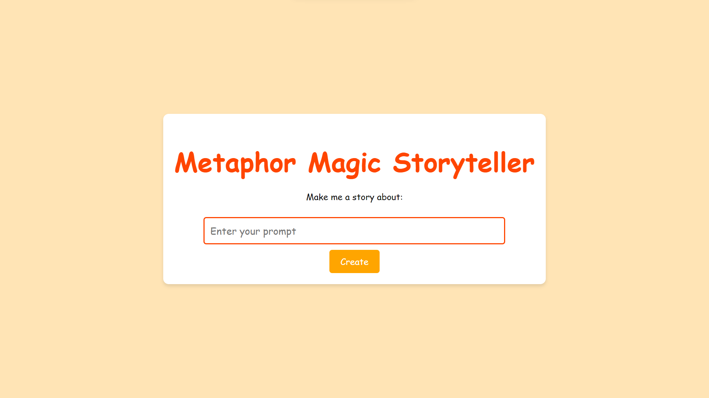

# Metaphor Magic Storyteller



This web application allows you to create unique and creative stories for kids based on book summaries through Metaphors and OpenAIs API. You can enter a prompt, and the application will generate a creative and unique story with text and images. Parents now don't have to worry about finding a new story every day for their kid.

## How It Works

1. **Enter a Prompt:**
   - You start by entering a prompt, which serves as the basis for the story you want to create.

2. **Python Script & Metaphor API:**
   - Behind the scenes, a Python script uses machine learning models to generate book summaries related to your prompt.
   - The app interacts with the Metaphor API to search for books related to the prompt.

3. **Story Generation:**
   - The top book summaries are selected, and their content is summarized and combined.
   - The app uses GPT-3.5-turbo to create a unique and creative story for kids based on the combined book summaries.

4. **Story Display:**
   - The generated story is displayed on the Story Page.
   - Each page of the story includes an image and text.
   - You can navigate through the story pages using the "Previous" and "Next" buttons.

## Getting Started

1. **Prerequisites:** Make sure you have [Node.js](https://nodejs.org/) installed on your local machine.

2. **Installation:**

   - Clone the repository:
     ```bash
     git clone https://github.com/yourusername/metaphor-magic-storyteller.git
     ```
   - Change to the project directory:
     ```bash
     cd metaphor-magic-storyteller
     ```
   - Install the dependencies:
     ```bash
     npm install
     ```

3. **Starting the App:**
   - Run the development server:
     ```bash
     npm start
     ```
   - Open [http://localhost:3000](http://localhost:3000) in your web browser.

## Contributing

We welcome contributions from the community. If you'd like to contribute, please fork the repository and create a pull request.

## License

This project is licensed under the MIT License.
